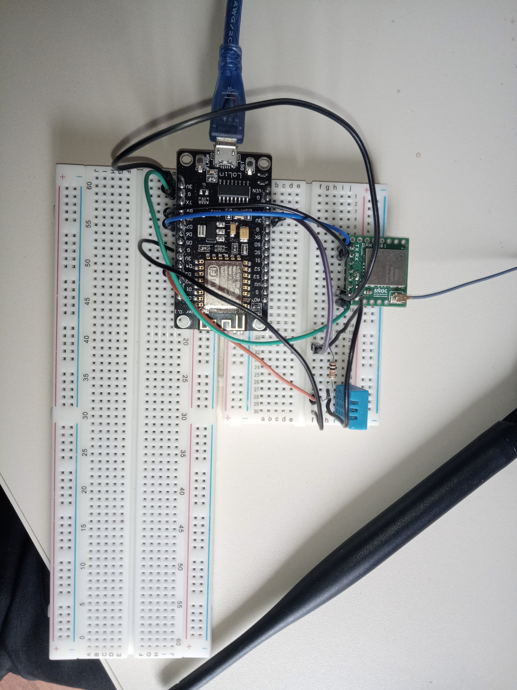

# Projet d'IoT

## Description et technologies utilisées

Pour ce projet, nous avions pour objectif de récupérer les informations provenant de notre capteur DHT11 ainsi que les informations météorologiques de la ville dans laquelle nous étions
Nous avons utilisés la technologies SigFox pour récupérer les informations du capteur, et la technologie MQTT pour 
récupérer les informations depuis le site openweathermap.org.
Les informations sont seulement disponibles en local, sachant que l'utilisation de la connection MQTT ne s'est faite que pour récupérer les informations du .json
depuis le site vers ce PC, nous n'utilisons pas de serveurs en ligne. L'utilisation de MQTT était aussi plus simple pour la gestion des topics, avec les subscribe et publish.

Nous avons créé un fichier html pour afficher les informations de notre station (+ css),
qui est lié à un fichier .js qui lui se subscribe au différent topics créés

Nous avons récuperez les informations du fichier json de Open Weather API à l'aide d'un script python,
qui lui même publie les bonnes informations sur chaque topic créés

Ce même script python récupère les message du capteur à travers un fichier json générez par Flask.py,
et qui s'update à chaque émission du capteur
Les informations sont récupéré et modifié pour pouvoir être publish sur les bons topics et affichez sur le site

## Exécuter le projet

Si vous souhaitez exécuter le projet de votre coté, il vous faut:

* Initialisez votre backend Sigfox
	-Téléverser le fichier sketch_jan20a.ino vers votre carte NodeMcu et lancez le programme
	-Si votre montage est correctement effectué, vous devriez récupérer l'ID de votre BRKWS01
	 ainsi que la température et le taux d'humidité
	-Allez sur le site https://backend.sigfox.com/, recherchez votre capteur grâce à son ID
	 Cliquez sur son ID, allez dans message et vous verrez la reception des messages

* Lancer un serveur MQTT local sur votre PC
	-Installez mosquitto sur votre PC
	-Dans le bon dossier, lancez l'invité de commande en admin et tapez:
		mosquitto.exe -c mosquitto.conf -v
	
* Lancer ngrok pour sécurisez votre votre tunnel vers votre localhost, et pouvoir récuperer 
	-Installez ngrok depuis ngrok.com
	-Cliquez sur ngrok.exe et tapez : ngrok.exe http 5000 -region eu
	-Récuperez le lien en face de "forwarding"

* Initialisez votre backend
	-Retourner sur Sigfox Backend, cliquez sur le "device type" de votre capteur
	 allez dans callbacks, créez un custom callbacks, coller votre URL ngrok dans "URL pattern"
	 utilisez la méthode POST, tapez : application/json dans "Content type" et dans "Body":
```c
	{
  	"device" : "{device}",
  	"data" : "{data}",
  	"time" : "{time}",
  	"duplicate" : "{duplicate}",
  	"snr" : "{snr}",
  	"seqNumber" : "{seqNumber}",
  	"station" : "{station}"
	}
```	

* Installez Flask pour pouvoir récuperer les messages de votre capteur en json
	-Tapez : pip install Flask
	-Créez un fichier python avec ce code :
```python
from flask import Flask
from flask import request
from flask import jsonify
import json

app = Flask(__name__)


@app.route("/", methods=['POST'])
def data():
	body = request.json
	if body == None:
		return "not a json"
	else:   
		with open('data.json', 'w') as outfile:
			json.dump(body, outfile)
			print(body)
	return jsonify(body) 

app.run(debug=True)
```

* Lancez le fichier python meteo_python.py

* Ouvrez index.html dans votre navigateur, et votre station météo est fonctionnelle !!

## Montage éléctronique


### Usage potentiel

Ce montage, monté de façon ergonomique et facilement utilisable, peut être utilisé en tant que thermomètre intelligent, que l'on installerai chez soi.
On pourrait consultrer les informations de temperature et d'humidité de sa maison (même plus si on y ajoute d'autres capteurs) depuis son smartphone, ainsi que les informations de météo classiques
